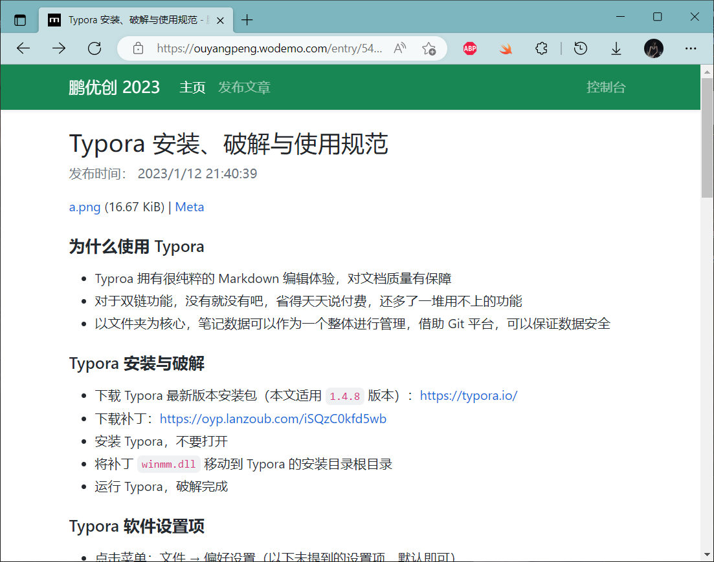

# 我的磨主题

> Bootstrap 风格的 Wodemo 主题



## 项目信息

- 作者：欧阳鹏
- 官方网站：https://apee.top
- 开发日期：2023 年 1 月 12 日

## 主题代码

打开[站点设置](https://s.wodemo.com/admin/site)，点击 Templates 进入设置。

- 主页模板：[`home.html`](./dist/home.html)
- 文章页模板：[`page.html`](./dist/page.html)
- 主页列表模板
    ```
    {wo.entry.title}
    {wo.entry.creation.timestamp}
    {wo.entry.url}
    ```

## 我的磨快速清空默认模板

将主页模板设置为如下内容即可：

```html
<style>
    .apee-wodemo-main~* {
        display: none !important;
    }
</style>
<div class="apee-wodemo-main">
    你的网页内容
</div>
```

## 打包流程

运行下面的命令，主题文件将在 `dist` 目录生成。

```bash
npm run build

主题文件已生成，请访问对应文件：
👉 主页模板：/dist/home.html
👉 文章页模板：/dist/page.html
```

## 主题开发说明

- 本项目要求 TypeScript 开发
- 主页模板的 HTML 代码放在 `/html/home.html` 中
- 文章页模板的 HTML 代码放在 `/html/page.html` 中
- 主页模板的 TypeScript 脚本代码放在 `js/home.ts` 中
- 文章页模板的 TypeScript 脚本代码放在 `js/page.ts` 中